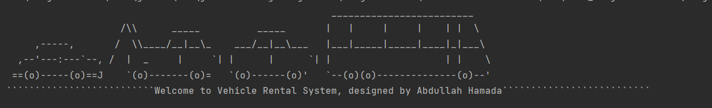

```markdown
# 🚗 OOP Learning Projects 🏍

I will be making really simple (most likely one) projects in this repo for the purpose of learning OOP topics.

## 🚗 Vehicle Rental System 🚗

Welcome to the **Vehicle Rental System** project! This Java-based console application is designed to help you learn Object-Oriented Programming (OOP) concepts while managing a rental inventory of motorcycles, trucks, and cars. Let's dive in!

## 🚀 Features

- View available motorcycles, trucks, and cars 🏍 🚚 🚗
- Rent vehicles by specifying the vehicle type, ID, and price 💰
- Add new vehicles to the inventory with details such as name, model, price, quantity, type, and manufacturing year 📝
- Validation of user inputs to ensure data integrity ✅
- Dynamic tax calculation based on the vehicle type 🧮
- User-friendly command-line interface 💻 ( I hate java's GUI )
- Clear and structured codebase with modular design 🧱

## 📋 Prerequisites

Before you start, make sure you have the following:

- Java Development Kit (JDK) ☕ preferably the latest
- Integrated Development Environment (IDE) or Text Editor such as IntelliJ IDEA, or Visual Studio Code 🧪
```
## 🛠 Getting Started

1. Clone the repository to your local machine:

```bash
   git clone https://github.com/AbdullahHamadax/OOP-Learning-Projects.git
```
2. Open the project in your preferred IDE.

3. Run the `Main.java` file to start the Vehicle Rental System.

## 📝 Usage

1. Upon launching the application, you will be presented with a nice welcome message & a menu with the following options:

   - View available vehicles 🚗
   - Rent a vehicle 🏍
   - Add a vehicle ➕
   - Exit 🚪

2. To view available vehicles, select option 1 and choose the vehicle type (A for motorcycles, B for trucks, C for cars).

3. To rent a vehicle, select option 2 and follow the prompts to specify the vehicle type, ID, and price.

4. To add a new vehicle to the inventory, select option 3 and follow the prompts to enter vehicle details.

5. Exit the application by selecting option 4.

## 📸 Screenshots
1. **Welcome Message**:
   
   
2. **Main Menu**:
   
   
3. **Viewing Available Vehicles (Dynamic Content)**:
   
   
4. **Renting Vehicles (Dynamic Content)**:
   
   
5. **Adding Vehicles (Dynamic Content)**:
   

## 🧱 Object-Oriented Programming (OOP) Concepts 🎯

The Vehicle Rental System project revolves around several fundamental & must learn for all students OOP concepts:

1. **Inheritance (🏭):** Inheritance is utilized to create a hierarchy of vehicle types. The base class, `Vehicle`, is extended by `Motorcycle`, `Truck`, and `Car` classes, inheriting common properties and behaviors while allowing for specialization.

2. **Polymorphism (🦄):** Polymorphism is achieved through method overriding in the subclasses. Each vehicle type (`Motorcycle`, `Truck`, and `Car`) provides its own implementation of the `getTaxes` and `getManufacturingYear` methods, demonstrating polymorphic behavior `( more methods might ba added in the future )`

3. **Encapsulation (🔒):** Encapsulation is maintained by using private member variables and providing accessors (the usual getters and setters) where necessary to control access to the properties of vehicle objects, ensuring data integrity/security.

4. **Abstraction (🧩):** Abstraction is demonstrated through the abstract class `Vehicle`, which defines a blueprint for all vehicle types. Subclasses provide concrete implementations while adhering to the common structure defined in the abstract class, you can easily observe that abstraction is related to inheritance in some way.

5. **Composition (🧰):** The project demonstrates composition by aggregating vehicle objects within ArrayLists for `Motorcycle`, `Truck`, and `Car`. This composition allows for managing and interacting with collections of vehicles. `( more types might be added in the future )`

6. **Dynamic Binding (🧬):** Dynamic binding is achieved through method calls to the overridden methods such as `getTaxes` and `getManufacturingYear`. The appropriate method is dynamically bound at runtime based on the actual object type, I think you can notice t  hat this is related to **Polymorphism(🦄)**


## 📂 Project Structure

The project is organized into the following classes:

- `Main.java`: The main entry point of the application that handles user interactions.
- `Vehicle.java`: An abstract class representing the base class for all vehicle types.
- `Motorcycle.java`: A class representing motorcycle-specific properties and behaviors.
- `Truck.java`: A class representing truck-specific properties and behaviors.
- `Car.java`: A class representing car-specific properties and behaviors.

## 🤝 Contributing

Contributions are welcome! If you'd like to contribute to this project, please follow these steps:

1. Fork the repository.
2. Create a new branch for your feature or bug fix.
3. Make your changes and test them thoroughly.
4. Commit your changes and create a pull request.
